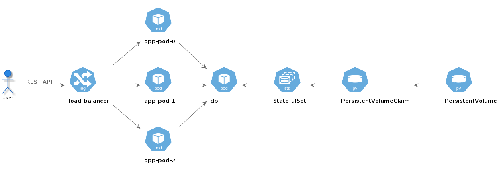

- [Aplicação exemplo](#aplicação-exemplo)
  - [Lista de tarefas](#lista-de-tarefas)
    - [Ambiente](#ambiente)
- [Docker](#docker)
  - [Com SQLite](#com-sqlite)
  - [Com PostgreSQL](#com-postgresql)
- [Docker compose](#docker-compose)
  - [Declaração do ambiente](#declaração-do-ambiente)
  - [Execução de ambiente](#execução-de-ambiente)
- [Cluster Kubernetes](#cluster-kubernetes)
  - [Execução explícita](#execução-explícita)
    - [*Pods*](#pods)
    - [*Load balancer*](#load-balancer)
  - [Declaração sem isolamento de base de dados](#declaração-sem-isolamento-de-base-de-dados)
    - [Gestão de pods](#gestão-de-pods)
  - [Isolamento da base de dados](#isolamento-da-base-de-dados)

# Aplicação exemplo

## Lista de tarefas

A aplicação exemplo implementa uma lista de tarefas em Python 3, recorrendo à *framework* Flask, e ao ORM [SQLAlchemy](https://www.sqlalchemy.org/).

Os *endpoints* são os seguintes:

- `GET /lists` : obtém a listagem de todas as listas de tarefas.
  
      curl localhost:5000

- `POST /lists` : regista uma nova lista de tarefas (parâmetros JSON).
  
      curl -X POST -H "Content-Type: application/json" -d'{"name": "test"}' localhost:5000

O código fonte está disponível em [src/app.py](src/app.py).

### Ambiente

```bash
$ pip freeze
click==8.0.1
Flask==2.0.1
Flask-SQLAlchemy==2.5.1
greenlet==1.1.0
itsdangerous==2.0.1
Jinja2==3.0.1
MarkupSafe==2.0.1
SQLAlchemy==1.4.15
Werkzeug==2.0.1
```

# Docker

## Com SQLite

A aplicação executa num *container* com python.

    docker run --rm -p 5000:5000 -v $(pwd)/src:/app --name app -it python:3.8.2-slim-buster bash

- `--rm` Evita a criação de cache de execução
- `-p` Redireciona uma porta no *host* para uma porta no *container* (`porta host:porta container`)
- `-v` Monta o volume indicado (`caminho host:caminho container`)
- `--name` Atribui o nome indicado ao *container*, que passará a funcionar como identificador de execução, e *hostname*
- `-it` Permite a execução de *shells* interativas (também disponível para `docker exec`)

Após iniciar uma sessão interativa no *container*, falta instalar dependências e iniciar a aplicação.

    root@268d3dc491ad:/# pip install Flask Flask-SQLAlchemy
    cd /app
    python app.py

A aplicação está disponível em `localhost:5000`

## Com PostgreSQL

Pretende-se agora alterar a base de dados para [PostgreSQL](https://www.postgresql.org/). O *container* será construído com as dependências necessárias, tal como descrito no [Dockerfile](Dockerfile).

O *container* da aplicação será construído com o nome `app`.

    docker build --tag app .

É também criada uma rede à qual os dois *container*, i.e., aplicação e base de dados, irão pertencer.

    docker network create net

Esta rede é *bridge*, e suporta resolução de nomes. O nome de rede de cada *container* é o nome indicado na sua execução.

Os *containers* PostgreSQL necessitam da definição de uma variável de ambiente  (`POSTGRES_PASSWORD`) com a *password* a utilizar pelo utilizador `postgres`.

    docker run --rm --network net -v $(pwd)/data/app -e POSTGRES_PASSWORD=foobar --name db postgres:13.3-alpine

- `--network` Integra o *container* na rede indicada
- `-e` Atribui um valor a uma variável de ambiente

O *container* fica listado como *em execução*.

    docker ps

É necessário criar a base de dados antes de iniciar a aplicação.

    docker exec -it db bash
    bash-5.1# su postgres
    / $ psql
    psql (13.3)
    Type "help" for help.

    postgres=# create database tasklists;
    CREATE DATABASE
    postgres=# \q
    / $ exit
    bash-5.1# exit
    exit

Por último, inicia-se a aplicação, que voltará a estar disponível em `localhost:5000`

    docker run --rm --network net -v $(pwd)/src:/app -p 5000:5000 --name app app

# Docker compose

## Declaração do ambiente

O ambiente de execução da aplicação, i.e., os dois *containers*, pode ser declarado num ficheiro de configuração (no formato `YAML`), simplificando a execução.

*Containers* declarados no mesmo conjunto de serviços partilham automaticamente a mesma rede *bridge*.

O container `db` é criado com um volume que persiste os ficheiros que suportam a base de dados.

Ver [docker-compose.yml](docker-compose.yml) para a descrição completa do ambiente.

## Execução de ambiente

Para executar o ambiente declarado:

    docker-compose up

Para executar em *background*:

    docker-compose up -d

Para desligar todos os *containers* declarados no ambiente:

    docker-compose down

# Cluster Kubernetes

A arquitetura da aplicação fica definida num nó de um *cluster* [Kubernetes](https://kubernetes.io/).



Um cluster é uma coleção de nós. Cada nó tem um conjunto de *pods*, serviços, volumes, e outros objetos relevantes para a arquitetura do sistema.

Um *pod* é uma abstração de computação que representa uma coleção de *containers*. O pod assegura apenas que os vários containers partilham o *localhost*, e que estão isolados por *default* do resto do *cluster*. As relações entre pods têm que ser definidas por outros objetos (e.g., serviços).

## Execução explícita

### *Pods*

É possível iniciar *pods* com base em imagens, de forma semelhante à execução de um *container*.

    kubectl run app-pod --image=app:latest --port=5000 --image-pull-policy=Never

- `--image` Imagem a executar no pod
- `--port` Porta que o pod vai expor aos restantes pods do cluster (mas não ao exterior)
- `--image-pull-policy` Executa apenas imagens locais

Para inspecionar a configuração do *pod*:

    kubectl describe pod/app-pod

Na descrição estão disponíveis vários indicadores sobre o estado do *pod*.

### *Load balancer*

Um `LoadBalancer` é um serviço no *cluster* que permite, entre outros aspetos, aceder um endereço ip interno do *cluster* (i.e., um pod) a partir do exterior.

    kubectl create service loadbalancer lb-svc --tcp=5000:5000

O serviço não oferece acesso ao exterior ao *pod*. É necessário editar a sua configuração:

    kubectl edit service/lb-svc

    ...
    selector:
        run: app-pod
    ...

O seletor corresponde a um identificador válido do *pod* que *load balancer* vai controlar. Esse identificador pode ser obtida na descrição do *pod*.

## Declaração sem isolamento de base de dados

Os vários *pods* e serviços podem ser declarados em ficheiros [YAML](https://en.wikipedia.org/wiki/YAML).

Ver [kubernetes/deployment.yml](kubernetes/deployment.yml) para a declaração do objeto `Deployment`, com a definição do *pod* com a aplicação.

Para executar:

    kubectl apply -f deployment.yml

Para eliminar a configuração:

    kubectl delete -f deployment.yml

Ver [kubernetes/load-balancer.yml](kubernetes/load-balancer.yml) para a declaração do *load balancer*.

Para criar a arquitetura:

    kubectl apply -f deployment.yml
    kubectl apply -f load-balancer.yml

O *cluster* fica com as réplicas da aplicação em execução, e o acesso é distribuído pelo serviço de *load balancing*.

Nota: Este cenário assume SQLite como base de dados, pelo que será necessário editar a aplicação, removendo o comentário da linha correta de configuração do SQLAlchemy.

É possível inspecionar o estado do *cluster*:

    kubectl get all

O output permite identificar inequivocamente cada objeto registado.

É também possível ficar a observar alterações de estado num determinado tipo de objeto:

    kubectl get pod -w

### Gestão de pods

É possível entrar num *pod* recorrendo ao seu identificador (disponível com `kubectl get all`):

    kubectl exec -it pod/<nome-do-pod> -- bash

É possível observar o *standard output* de um *pod*:

    kubectl logs -f pod/<nome-do-pod>

- `-f` Mantém a captura ativa.

## Isolamento da base de dados

Pretende-se que a base de dados seja PostgreSQL, num pod independente da aplicação, já que representa um componente do sistema que deve manter estado (ao contrário da API REST disponibilizada pelos pods com a aplicação).

Vai ser necessário definir um `PersistentVolumeClaim` de forma a assegurar a persistência da informação, e o *pod* será definido por um objeto `StatefulSet`, semelhante ao `Deployment`, mas focado na persistência de estado.

Ver [kubernetes/persistent-volume-claim.yml](kubernetes/persistent-volume-claim.yml) para o `PersistentVolumeClaim`, e [kubernetes/statefulset.yml](kubernetes/statefulset.yml) para o `StatefulSet`.

O `PersistentVolumeClaim` necessita de uma correspondência num `PersistentVolume` com, no mínimo, o mesmo espaço disponível. Esse `PersistentVolume` deve ser registado pelo administrador do *cluster*, e o sistema fará a correspondência entre *claims* e recursos disponíveis.

Ver [kubernetes/persistent-volume.yml](kubernetes/persistent-volume.yml) para a definição do `PersistentVolume`.

O objeto `StatefulSet` define o *pod* com a base de dados, mas não expõe o pod ao *cluster* da forma mais conveniente.

Por um lado, a porta utilizada pelo PostgreSQL (`5432`) deve ficar acessível aos restantes pods, e por outro, o *hostname* atribuído ao *pod* é o resultado de uma composição entre o nome determinístico do *pod*, do serviço, do *namespace*, e do cluster.

Por exemplo, um *pod* com nome `app-db-st` tem nome fixo determinado pelo `StatefulSet` de `app-db-st-0`. Se o serviço tiver nome `app-db-svc`, e o namespace for o `default`, o *hostname* gerado será `app-db-st-0.app-db-svc.default.svc.cluster.local`. É este nome que será resolvido por DNS para o endereço ip do *pod*.

Para encurtar o nome (e.e., `db`) é necessário definir um *alias* através da declaração de um serviço (que serve apenas para esse propósito).

Ver [kubernetes/statefulset-service.yml](kubernetes/statefulset-service.yml) para a definição de dois serviços que configuram a exposição do *pod* com a base de dados.

Para inicializar a aplicação é necessário construir a imagem e registar os vários objetos no cluster:

    docker build -t app .
    kubectl apply -f kubernetes/persistent-volume.yml
    kubectl apply -f kubernetes/persistent-volume-claim.yml
    kubectl apply -f kubernetes/statefulset.yml
    kubectl apply -f kubernetes/statefulset-service.yml
    kubectl apply -f kubernetes/deployment.yml
    kubectl apply -f kubernetes/load-balancer.yml

Os vários objetos podem ser registados apenas com a indicação do diretório que contém os ficheiros de configuração:

    kubectl apply -f kubernetes/

Podem também ser removidos com uma abordagem semelhante:

    kubectl delete -f kubernetes/

Para remover pods e serviços do *cluster* (sem indicação de ficheiros de configuração):

    kubectl delete all --all
